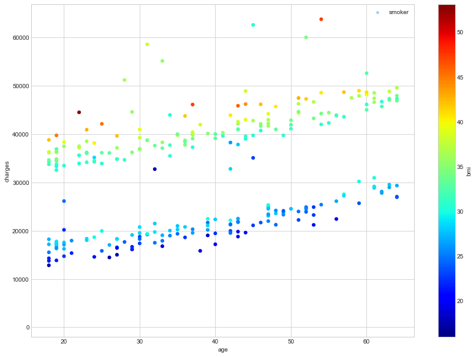

# 🏥 Health Insurance Analytics

This project explores **health insurance cost analysis** using machine learning and data visualization. It uncovers how variables like age, BMI, smoking status, and region affect medical insurance charges using Python and predictive analytics.

## 🔍 Project Overview

The notebook provides:

- **Exploratory Data Analysis (EDA):** Visual patterns and correlations between customer attributes and charges.
- **Predictive Modeling:** Linear regression to forecast charges.
- **Visualization:** Age, BMI, and smoking status impacts using color-coded plots.
- **Business Context:** Ties to real-world digital insurance trends, drawn from PwC’s industry frameworks.

## 📂 Files Included

- `Health Insurance Analytics.ipynb`: Main analysis notebook.
- `insurance.csv`: Dataset of 1,300+ customer profiles.
- Industry insights from:
  - PwC’s digital insurance transformation elements
  - Architecture for insurance companies
  - Use cases for customer experience innovation
- Visualization image outputs (`download.png`)

## 🧠 Key Insights

- Smokers have significantly higher medical charges.
- BMI and age are directly proportional to insurance costs.
- Predictive models can help insurers personalize offerings and manage risks.

## 💼 Relevance to Industry

The project aligns with key pillars of a modern digital insurer:
- **Advanced analytics** to prevent high-cost cases.
- **Customized underwriting** using health and behavior data.
- **Automation** to optimize claim and pricing workflows.

## 🛠️ Tech Stack

- Python (Pandas, Matplotlib, Seaborn, Scikit-learn)
- Jupyter Notebook
- CSV data processing
- Visualization techniques for insurance analytics

## 📈 Sample Output

## 📊 Dataset Info

- **Source:** Public domain dataset (typically used for regression analysis)
- **Features:** `age`, `sex`, `bmi`, `children`, `smoker`, `region`, `charges`

## 🚀 Future Enhancements

- Add classification models to predict smoker likelihood.
- Deploy an API or dashboard to interact with predictions.
- Explore deeper use cases from PwC’s innovation map.

## 📚 References

- [PwC Insurance Research](https://www.pwc.com/)
- [Kaggle: Medical Cost Personal Dataset](https://www.kaggle.com/mirichoi0218/insurance)
